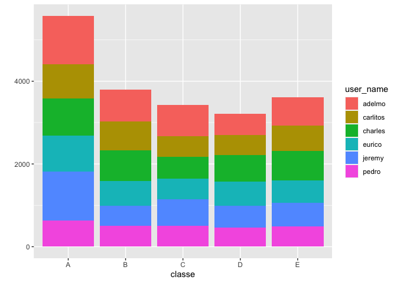

# Introduction
Using devices such as Jawbone Up, Nike FuelBand, and Fitbit it is now possible to collect a large amount of data about personal activity relatively inexpensively. These type of devices are part of the quantified self movement – a group of enthusiasts who take measurements about themselves regularly to improve their health, to find patterns in their behavior, or because they are tech geeks. One thing that people regularly do is quantify how much of a particular activity they do, but they rarely quantify how well they do it. In this project, your goal will be to use data from accelerometers on the belt, forearm, arm, and dumbell of 6 participants. They were asked to perform barbell lifts correctly and incorrectly in 5 different ways. More information is available from the website here: [http://web.archive.org/web/20161224072740/http:/groupware.les.inf.puc-rio.br/har] (see the section on the Weight Lifting Exercise Dataset).


## Loading the required libraries and DATA :


```r
library(ggplot2)
library(caret)
```

```
## Loading required package: lattice
```

```r
library(rpart)
library(rpart.plot)
library(randomForest)
```

```
## randomForest 4.6-14
```

```
## Type rfNews() to see new features/changes/bug fixes.
```

```
## 
## Attaching package: 'randomForest'
```

```
## The following object is masked from 'package:ggplot2':
## 
##     margin
```

```r
library(gbm)
```

```
## Loaded gbm 2.1.5
```

Loading the data 


```r
train_url <- "http://d396qusza40orc.cloudfront.net/predmachlearn/pml-training.csv"
test_url  <- "http://d396qusza40orc.cloudfront.net/predmachlearn/pml-testing.csv"

data_train <- read.csv(url(train_url))

data_test <- read.csv(url(test_url))
```

## Exploratory Data Analysis and Data Cleansing 
The data contains NA values which are not of use but first we can look at the dimensions of the raw data.


```r
dim(data_train)
```

```
## [1] 19622   160
```

```r
dim(data_test)
```

```
## [1]  20 160
```

## Some Basic Exploratory Analysis:
Below we can see we are working with 5 classes 

```r
table(data_train$classe)
```

```
## 
##    A    B    C    D    E 
## 5580 3797 3422 3216 3607
```

Below we can see unique users and proportion of the contribution to readings by them


```r
prop.table(table(data_train$user_name))
```

```
## 
##    adelmo  carlitos   charles    eurico    jeremy     pedro 
## 0.1983488 0.1585975 0.1802059 0.1564570 0.1733768 0.1330140
```

To infer more about data we can plot a qplot

```r
qplot(x = classe, fill = user_name, data = data_train)
```

<!-- -->


## Cleaning the data
We need to check for the columns which contains most of its values as NA as these columns won't support our analysis

We can do this procedure in multiple ways but the most statistical approach would be to remove the variables which have near to 0 variance, as these variables cannot help in analysis


```r
near_zero_var <- nearZeroVar(data_train)

data_train_2 <- data_train[ , - near_zero_var]
data_test_2 <- data_test[ , - near_zero_var]

# now if we look at the dimensions :
dim(data_train_2)
```

```
## [1] 19622   100
```

```r
dim(data_test_2)
```

```
## [1]  20 100
```

Now removing the variables which contain more than 95 % NA values


```r
na_values <- sapply(data_train_2, function(x) mean(is.na(x))) > 0.95
data_train_3 <- data_train_2[,na_values == FALSE]
data_test_3 <- data_test_2[,na_values == FALSE]
```

Now we can look at the dimensions of the data :


```r
dim(data_train_3)
```

```
## [1] 19622    59
```

```r
dim(data_test_3)
```

```
## [1] 20 59
```

Now if we look at the data closely we can see that first seven columns are not related to the data and we can remove it from the data final data frame.


```r
train_final <- data_train_3[, 8:59]
test_final <- data_test_3[, 8:59]
```

Now we have cleaned the data and we can proceed with Machine learning analysis on the data.

## Practical Machine Learning Analysis 

#### The first step will be to separate the training set further into a train and validation set, we will keep 75 % data in training set and other in validation set


```r
set.seed(12345)
inTrain <- createDataPartition(y = train_final$classe, p = 0.75, list = FALSE)
training <- train_final[inTrain, ]
testing <- train_final[-inTrain, ]
```

Its always good to check the dimensions

```r
dim(training)
```

```
## [1] 14718    52
```

```r
dim(testing)
```

```
## [1] 4904   52
```

### Performing different machine learning classifiers on the training data.

This is clearly a classification problem as we need to predict the class (A, B, C, D, E) using the feature (or variables) and so the most commonly used classifying machine learning algorithms are Decision Trees and RandomForest and here we will try both the algorithms to check which algorithm performs better in terms of accuracy on the validation set and then we will choose the algorithm with best accuracy to predict from the testing set.

We have already cleaned the data and while cleaning the data we have already removed the variables with near to 0 variance and hence we can directly start using the caret package to apply the machine learning algorithms.

## 1. Decision Tree Model

Training a Decision Tree classifier 

```r
DT_model <- train(classe ~ . , data = training, method = "rpart")
```

Predicting on the validation set and printing the confusion matrix

```r
DT_predict <-  predict(DT_model,testing)
confusionMatrix(as.factor(testing$classe), DT_predict)
```

```
## Confusion Matrix and Statistics
## 
##           Reference
## Prediction    A    B    C    D    E
##          A 1274   30   70   20    1
##          B  396  317  198   38    0
##          C  434   24  311   86    0
##          D  343  151  111  199    0
##          E  209  183  206   33  270
## 
## Overall Statistics
##                                           
##                Accuracy : 0.4835          
##                  95% CI : (0.4694, 0.4976)
##     No Information Rate : 0.5416          
##     P-Value [Acc > NIR] : 1               
##                                           
##                   Kappa : 0.3235          
##                                           
##  Mcnemar's Test P-Value : <2e-16          
## 
## Statistics by Class:
## 
##                      Class: A Class: B Class: C Class: D Class: E
## Sensitivity            0.4797  0.44965  0.34710  0.52926  0.99631
## Specificity            0.9462  0.84949  0.86427  0.86639  0.86380
## Pos Pred Value         0.9133  0.33404  0.36374  0.24751  0.29967
## Neg Pred Value         0.6062  0.90190  0.85552  0.95683  0.99975
## Prevalence             0.5416  0.14376  0.18271  0.07667  0.05526
## Detection Rate         0.2598  0.06464  0.06342  0.04058  0.05506
## Detection Prevalence   0.2845  0.19352  0.17435  0.16395  0.18373
## Balanced Accuracy      0.7129  0.64957  0.60568  0.69782  0.93006
```

As we can see the Decision tree  model did not perform very well it has accuracy of only 48.5 %, Now we can perform a random forest model to check its accuracy.

## 2. Random Forest Model 

Training a Random Forest model on the training set 

```r
RF_model <-  train(classe ~ . , method = "rf", data =  training, ntree = 100)
```

Predicting on the validation set and printing the confusion matrix

```r
RF_predict <- predict(RF_model, testing)
confusionMatrix(as.factor(testing$classe), RF_predict)
```

```
## Confusion Matrix and Statistics
## 
##           Reference
## Prediction    A    B    C    D    E
##          A 1395    0    0    0    0
##          B    1  945    3    0    0
##          C    0    4  846    5    0
##          D    0    0    9  790    5
##          E    0    0    0    1  900
## 
## Overall Statistics
##                                           
##                Accuracy : 0.9943          
##                  95% CI : (0.9918, 0.9962)
##     No Information Rate : 0.2847          
##     P-Value [Acc > NIR] : < 2.2e-16       
##                                           
##                   Kappa : 0.9928          
##                                           
##  Mcnemar's Test P-Value : NA              
## 
## Statistics by Class:
## 
##                      Class: A Class: B Class: C Class: D Class: E
## Sensitivity            0.9993   0.9958   0.9860   0.9925   0.9945
## Specificity            1.0000   0.9990   0.9978   0.9966   0.9997
## Pos Pred Value         1.0000   0.9958   0.9895   0.9826   0.9989
## Neg Pred Value         0.9997   0.9990   0.9970   0.9985   0.9988
## Prevalence             0.2847   0.1935   0.1750   0.1623   0.1845
## Detection Rate         0.2845   0.1927   0.1725   0.1611   0.1835
## Detection Prevalence   0.2845   0.1935   0.1743   0.1639   0.1837
## Balanced Accuracy      0.9996   0.9974   0.9919   0.9945   0.9971
```

As we can se the Random Forest Model performs very well with 99.49 % accuracy and looking at its accuracy I will pick Random Forest as our final model and now I will predict on the final testing data using our RF_model.

## Predicting on our final testing data using Random Forest (RF_model)


```r
final_prediction <- predict(RF_model, test_final)
final_prediction
```

```
##  [1] B A B A A E D B A A B C B A E E A B B B
## Levels: A B C D E
```

Above we get our predicted model on the final test set using the RF_model

### Conclusion 
#### Finally we can say that random forest (accuracy 99.49%) outperforms the decision tree algorithm (accuracy 48%) by looking at the accuracies and thus we chose random forest as our final model.

#### We considered only these algorithms as this problem is a classification problem and this two algorithms are considered the most used models in classification problems. We can look random forest as an extension to decision tree and thus we can justify its accuracy. 

#### Although Random Forest was Highly Accurate, it has some cons :
#### 1. It took around 12-15 mins to train the model
#### 2. It was a bit computer intensive and thus would take lot more time on lower end devices.

#### A more statistical approach could be applied to the training set by finding out the variables which account to most of the variance and this would reduce the variables increasing the effciency of the model but it would possibly have other significant effects like it can bring down the accuracy a little bit and thus it is the matter of further deep analysis.
